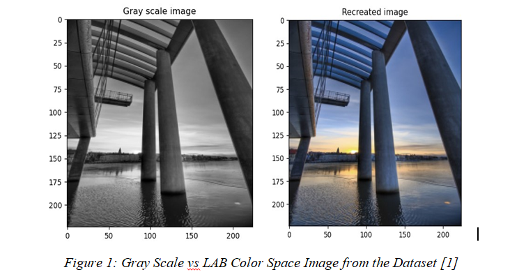

# Image-Colorization
CS 464 INTRODUCTION TO MACHINE LEARNING
Image Colorization
Our dataset contains grayscale and color versions of 25 thousand 224 x 224 pixels images. Colorized images exist in the form of LAB color space. LAB color space expresses color according to three parameters: L is for the lightness from black (0) to white (100), A is for green (-) to red (+) and B is for blue (-) to yellow (+). Unlike LAB color space, grayscale images do not contain any color information and they consist of only one dimension that illustrates shades of black or white. Grayscale and color image samples from the dataset can be seen in Figure 1.

In the project, we will train our algorithms to convert each pixel of grayscale image to a colorized pixel according to its LAB value. In other words, algorithms will be given the LAB color and grayscale values of images and they will try to map these values to each other. By that way, algorithms will be trained to predict the colorized version of grayscale pictures. To understand the image data, Python image processing libraries such as OpenCV will be used, especially in the preprocessing step (if necessary).
Main purpose of this project is to observe if grayscale images can be perfectly colorized. We will try to achieve our goal by implementing three different Convolutional Neural Network (CNN) algorithms which are Vanilla, Resnet and U-Net. After the implementation of all three algorithms, Vanilla CNN will be considered as baseline and the performance of other two algorithms will be compared according to the baseline. For the sake of performance, transfer learning method will be used in Resnet and U-Net algorithms.
Until 〖15〗^th of November, preprocessing of the image data will be done. Compatible pre-trained weights will be searched. Finally, Vanilla CNN algorithm will be implemented.

References
[1]	Shetty, S.,2018. Image Colorization. [online] Kaggle.com. Available at: <https://www.kaggle.com/shravankumar9892/image-colorization> [Accessed 23 October 2020].
